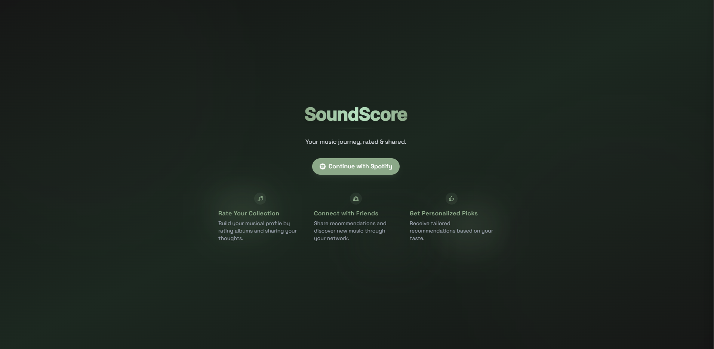
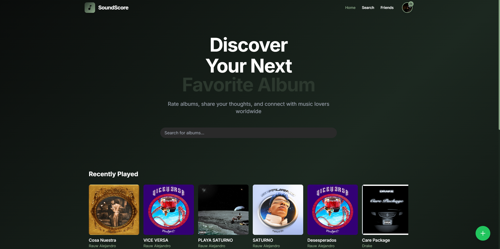
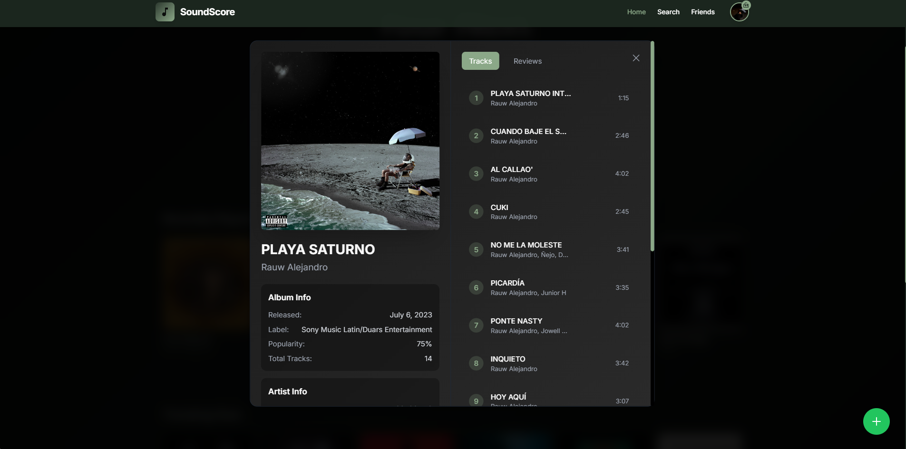
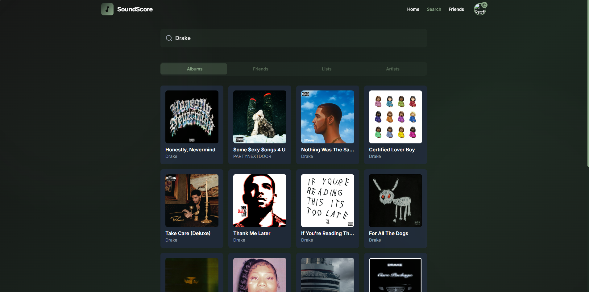
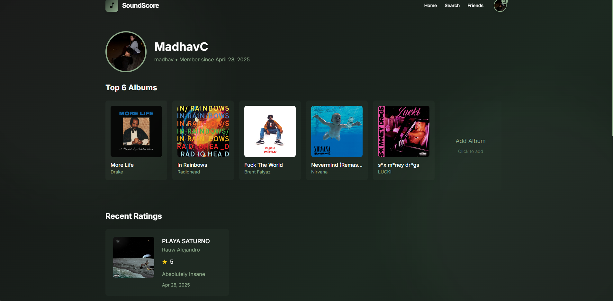
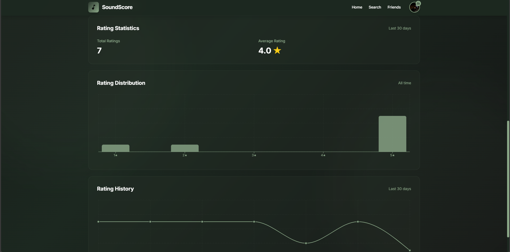
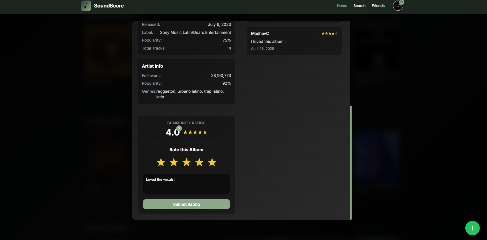
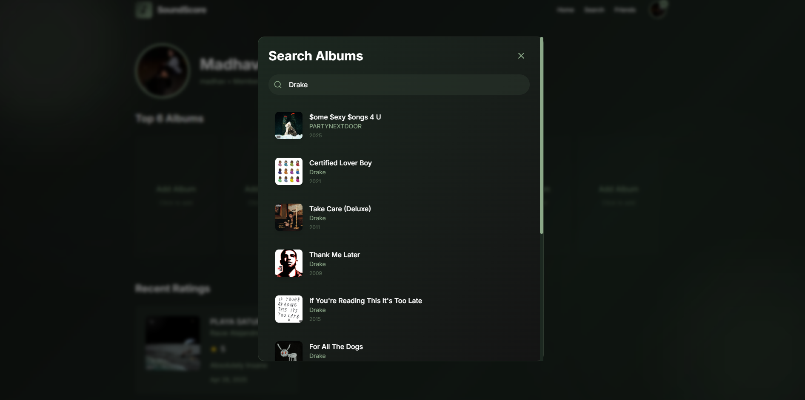
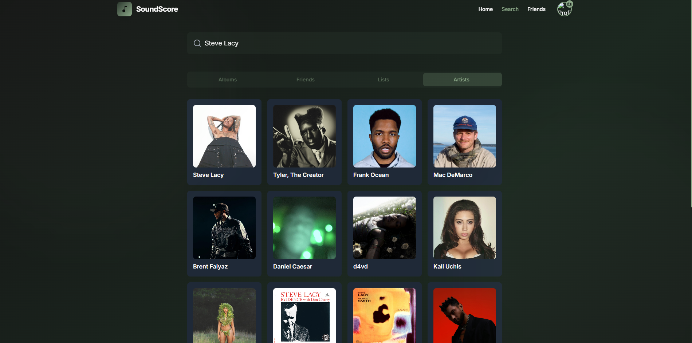
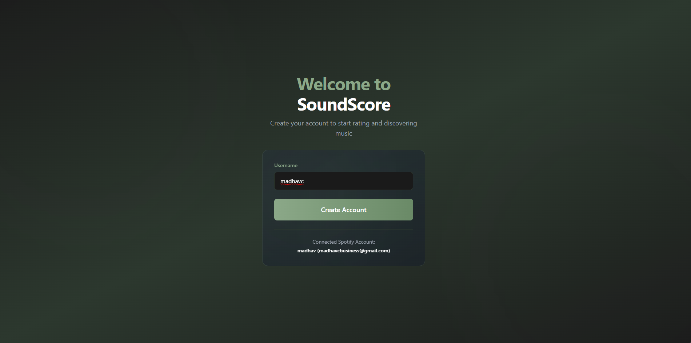

#  SoundScore (2025 beta v0.01)

<div align="center">
  <h3>Legacy Web Version Archive</h3>
  <p>Open-source fun web app developed in 2025. Archived as the original SoundScore beta web release.</p>

  [](LICENSE)
  
  
  
  
</div>

> This repository contains the original web beta release: **SoundScore (2025 beta v0.01)**.
>
> It is maintained as a legacy archive while the next-generation production app is prepared for release.

## Legacy Beta Features

- 🎧 **Spotify Integration**: Seamlessly connect with your Spotify account
- 📊 **Album Ratings**: Rate and review your favorite albums
- 🔍 **Smart Discovery**: Get personalized album recommendations
- 👥 **Social Features**: Connect with friends and share your music taste
- 📱 **Responsive Design**: Works across desktop and mobile
- 🌙 **Dark Mode**: Built for long listening sessions

## Screenshots (Legacy Web Build)

### Landing and Dashboard
<div align="center">
  
  
</div>

### Album Experience
<div align="center">
  
  
</div>

### User Profile and Stats
<div align="center">
  
  
</div>

### Social and Reviews
<div align="center">
  
  
</div>

### Discovery and Search
<div align="center">
  
  
</div>

## Running the Legacy Web Version

### Prerequisites

- Node.js (v14 or higher)
- MongoDB
- Spotify Developer Account

### Installation

1. Clone the repository:
```bash
git clone https://github.com/yourusername/SoundScore.git
cd SoundScore
```

2. Install dependencies:
```bash
# Install backend dependencies
cd backend
npm install

# Install frontend dependencies
cd ../frontend
npm install
```

3. Set up environment variables:
```bash
# Backend (.env)
MONGODB_URI=your_mongodb_uri
SPOTIFY_CLIENT_ID=your_spotify_client_id
SPOTIFY_CLIENT_SECRET=your_spotify_client_secret
JWT_SECRET=your_jwt_secret

# Frontend (.env)
REACT_APP_API_URL=http://localhost:5000
```

4. Start the development servers:
```bash
# Start backend server
cd backend
npm run dev

# Start frontend server (in a new terminal)
cd frontend
npm start
```

## Tech Stack

### Frontend
- React.js
- Framer Motion
- Tailwind CSS
- Axios

### Backend
- Node.js
- Express.js
- MongoDB
- JWT Authentication

### APIs
- Spotify Web API
- Last.fm API (for additional music data)

## Functional Areas

### Album Discovery
- Personalized recommendations based on listening history
- Trending albums in your network
- New releases from favorite artists

### Rating System
- Half-star rating system (0.5 to 5 stars)
- Detailed review support
- Rating history and statistics

### Social Features
- Follow other music enthusiasts
- Share ratings and reviews
- Collaborative playlists
- Activity feed

### Profile Customization
- Listening statistics
- Rating distribution
- Favorite genres
- Custom lists and collections

## Contributing

Contributions are welcome for maintenance and archival improvements. Please see the contributing workflow below.

1. Fork the repository
2. Create your feature branch (`git checkout -b feature/AmazingFeature`)
3. Commit your changes (`git commit -m 'Add some AmazingFeature'`)
4. Push to the branch (`git push origin feature/AmazingFeature`)
5. Open a Pull Request

## License

This project is licensed under the MIT License - see the [LICENSE](LICENSE) file for details.

## Acknowledgments

- [Spotify Web API](https://developer.spotify.com/documentation/web-api/)
- [Last.fm API](https://www.last.fm/api)
- [Tailwind CSS](https://tailwindcss.com/)
- [Framer Motion](https://www.framer.com/motion/)

---

<div align="center">
  <sub>SoundScore (2025 beta v0.01) — legacy open-source web app from 2025.</sub>
</div> 